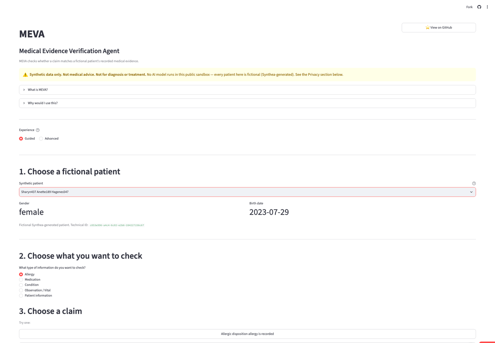
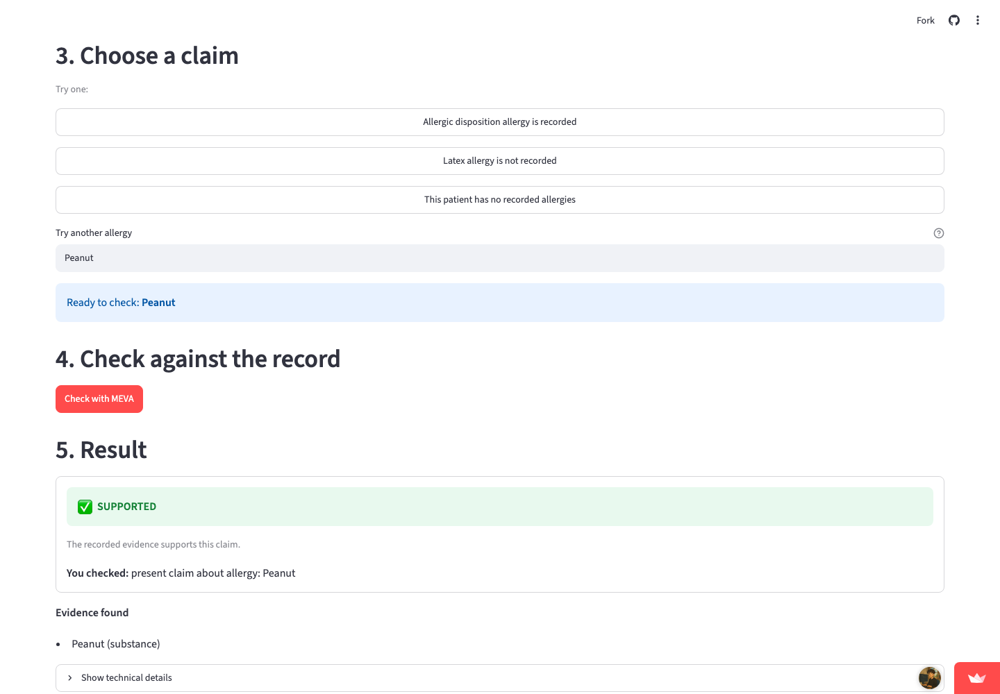
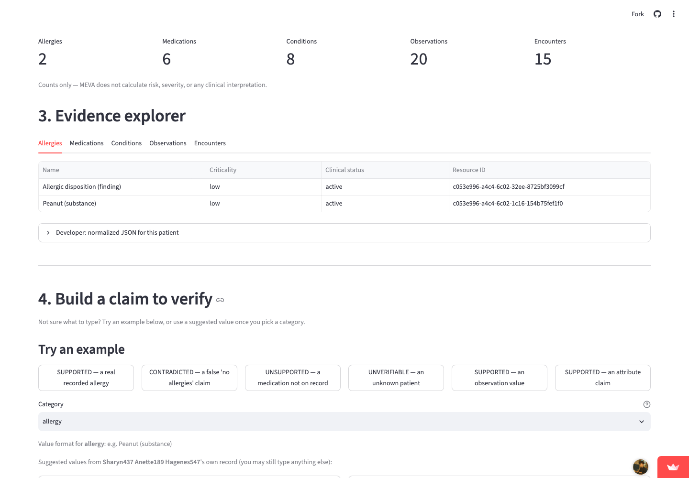
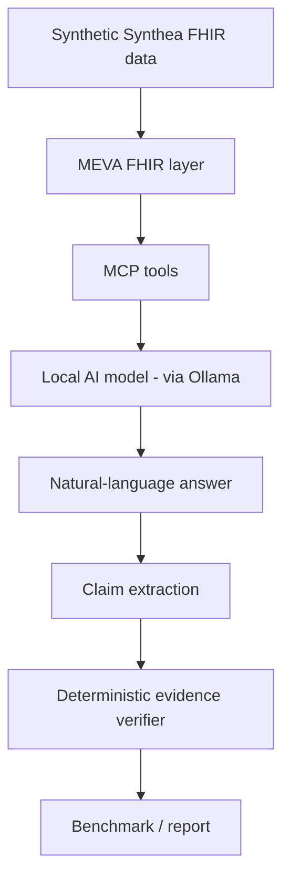

# MEVA
### Medical Evidence Verification Agent

**What it does:** MEVA evaluates whether AI-generated medical-record claims
are grounded in retrieved synthetic FHIR evidence, using a deterministic
(non-AI) verifier — no diagnosis, no treatment advice, no real patient data.

## 🧪 Live Sandbox

**Try MEVA in your browser — no Ollama, no API key, no installation required.**

### **[▶ Open Live Sandbox](https://meva-health-aigit-exbml8bjbokk28zs6amu3h.streamlit.app/)**

- **Synthetic data only** — 21 fictional, Synthea-generated patients
- **Deterministic verifier** — every result comes from plain Python evidence
  matching, not a model's opinion
- **No AI model runs in the public sandbox** — you build the claim yourself
  and MEVA checks it against real recorded (synthetic) data

**[Try Live Sandbox](https://meva-health-aigit-exbml8bjbokk28zs6amu3h.streamlit.app/)** ·
**[Quick Start](#quick-start)** ·
**[Benchmark Methodology](docs/benchmarking.md)** ·
**[Contribute](#contributing)**

> **MEVA is not a medical chatbot, diagnostic AI, clinical decision support
> tool, treatment recommendation system, or medical device.** It is not
> clinically validated. All patient data is 100% synthetic. See
> [Scope and safety](#scope-and-safety) below and `docs/safety-and-scope.md`
> for the full statement.

## See MEVA in action

Screenshots from the live hosted sandbox — **synthetic data only, not
medical advice, and no AI model runs in the hosted sandbox** (every result
comes from MEVA's deterministic verifier, not a model's opinion).

### Guided Mode



Guided Mode — choose a fictional patient and verify a claim using a simple
plain-English workflow.

### Evidence-backed verification



MEVA checks the claim against recorded synthetic FHIR evidence and returns
SUPPORTED, CONTRADICTED, UNSUPPORTED, or UNVERIFIABLE.

### Advanced Mode



Advanced Mode — technical evidence explorer and structured claim controls
for developers, researchers, and contributors.

## Why MEVA exists

Local AI agents can call tools, retrieve real data, and generate a
structured "answer" — but nothing forces that structured answer to actually
match the evidence the agent retrieved. MEVA measures that gap directly,
with a verifier that never trusts a model's self-report of its own
correctness.

## Architecture



MEVA supports **two evaluation modes**, reported separately and never
combined into one score (see `docs/decoupled-evaluation.md`):

- **END_TO_END** — the tested model answers a question AND encodes its own
  answer into MEVA's structured `MedicalClaim` schema, in one pass.
- **DECOUPLED** — the tested model answers in prose only; a separate fixed
  extractor model converts that saved prose into structured claims, which
  are verified the same way. This isolates "did the model know the right
  answer" from "did the model correctly format JSON."

In both modes, the final verification step — matching a claim against real
evidence — is always plain, deterministic Python. No LLM ever judges its
own (or another model's) correctness.

## Quick start

```bash
git clone https://github.com/Tanz2024/meva-health-ai
cd meva-health-ai

python3 -m venv .venv
source .venv/bin/activate

pip install -e .

pytest
```

> **MEVA is designed to be run from within a cloned copy of this
> repository** (as above — `git clone` then an editable install), not as a
> standalone package installed from elsewhere. Its synthetic FHIR fixtures
> (`data/synthetic/synthea/`) and benchmark definitions (`benchmarks/`) are
> read from repository-relative paths, not bundled as installable package
> data — a `pip install` of a built wheel/sdist outside a repo checkout
> will not have patient data available. This is current, intentional
> scope (a research/engineering repo, not a distributed library) — see
> `docs/publishing-checklist.md` if this changes in the future.

This runs the entire offline test suite (no AI model required — see
[What runs without AI](#what-runs-without-ai-ollama-not-required)).

**Optional — local AI:**

```bash
ollama pull qwen3:4b
python3 examples/verify_local.py
```

See `examples/` for more runnable scripts, and `docs/local-ai.md` for how
MEVA talks to Ollama.

## What runs without AI (Ollama not required)

Most of MEVA works with **no AI model at all**:

- FHIR parsing (`src/meva/fhir/`)
- Deterministic evidence verification (`src/meva/verification/`)
- Benchmark dataset loading and validation (`meva.benchmark.validator`)
- The full offline test suite (`pytest`)
- The verifier-challenge examples (`examples/verify_contradiction_demo.py`)
  — these test MEVA's own verification logic with a hand-written wrong
  claim, no live model involved

**Ollama is only needed** when actually running local model inference
(`examples/ask_local.py`, `examples/chat_local.py`) or model-assisted claim
extraction (`examples/run_decoupled_pilot.py`, `run_decoupled_full.py`,
`run_extractor_fidelity.py`).

## Synthetic data

MEVA's public patient fixtures (`data/synthetic/synthea/patient-01.json`
through `patient-21.json`) are generated **locally**, by this project, using
the official Apache-2.0-licensed [Synthea](https://github.com/synthetichealth/synthea)
generator (pinned to tag `v3.4.0`), with a fixed, documented, reproducible
seed. No real patient data is included anywhere. Full generation details
(exact command, seed, and per-file SHA-256 hashes) are in
[`data/synthetic/synthea/PROVENANCE.md`](data/synthetic/synthea/PROVENANCE.md).
See [`docs/synthetic-data.md`](docs/synthetic-data.md) for the full picture,
including why an earlier set of 18 patients (used through Stage 8A) was
replaced — that earlier set had been copied from a repository with no
declared license and is no longer part of the public dataset (see
[`docs/historical-sample-data-provenance.md`](docs/historical-sample-data-provenance.md)).

## Benchmark results

MEVA has two benchmark datasets on record, and they must not be conflated:

**PUBLIC REPRODUCIBLE DATASET: benchmark v0.4** — built entirely from the
locally-generated Apache-2.0 fixtures above (53 cases, 16 unique patients;
see [`benchmarks/v0.4/manifest.json`](benchmarks/v0.4/manifest.json)).
**v0.4 model-comparison results are pending** — no qwen3:4b/llama3.2:3b run
has been performed against v0.4 yet.

**HISTORICAL DEVELOPMENT RESULT: benchmark v0.3** — full qwen3:4b vs
llama3.2:3b results below. This was measured against the now-removed
former patient set (see above) — it remains a valid historical development
record of the methodology and findings, but is **not** a result on the
current public v0.4 dataset, and the two must not be compared directly.
Full report: [`docs/baseline-results-v0.3.md`](docs/baseline-results-v0.3.md)
(the numbers below use the **corrected** Stage 7C2.1 verifiable-coverage
formula — see that document for the correction history; the original,
uncorrected numbers are also disclosed there, not hidden).

**No winner is declared.** Read grounding score together with verifiable
coverage — a high grounding score computed over very few checkable claims
looks better than it is.

### Retrieval + END_TO_END structured-output metrics (v0.3, historical)

| | qwen3:4b | llama3.2:3b |
|---|---|---|
| Tool recall | 1.000 | 0.981 |
| Tool precision | 1.000 | 1.000 |
| Exact tool match | 1.000 | 0.962 |
| Evidence recall | 0.810 | 0.738 |
| E2E structured validity | 0.917 | 0.087 |
| E2E verifiable coverage | 0.656 | 0.120 |
| E2E grounding | 83% | 70% |

### DECOUPLED evaluation (v0.3, historical; separate, fixed qwen3:4b extractor)

| | qwen3:4b | llama3.2:3b |
|---|---|---|
| DECOUPLED verifiable coverage | 0.990 | 0.987 |
| DECOUPLED grounding | 89% | 80% |

DECOUPLED evaluation uses **qwen3:4b as a fixed claim extractor** for both
models' saved answers, including qwen3:4b's own — this introduces potential
extractor-specific bias, documented explicitly in
`docs/decoupled-evaluation.md`. END_TO_END and DECOUPLED answer different
questions and must never be read as "the model got better."

### Extractor validation — the extractor is not perfect

| | Development (10 fixtures) | Holdout (14 unseen fixtures) |
|---|---|---|
| Precision | 1.000 | **0.929** |
| Recall | 1.000 | **0.813** |
| F1 | 1.000 | **0.867** |
| Exact claim-set match | 1.000 | 0.857 |
| Negative-claim preservation | 1.000 | 1.000 |
| Attribute accuracy | 1.000 | 0.750 |

**Do not read the ~99% DECOUPLED coverage numbers above as "99% extraction
accuracy."** Coverage measures how much of the extractor's output the
verifier could check; the holdout numbers here measure whether that output
actually matches what the source answer said.

### Observation-category finding

Both models scored unusually low on observation-category questions:
**qwen3:4b 20%, llama3.2:3b 0% grounding (n=10 cases each)**. Stage 7D2.2
independently audited every observation case against MEVA's real FHIR data
and tool layer and found **no infrastructure or evaluation bug** that
invalidates these results — 18 of 20 model-case pairs are genuine model
grounding errors. Full audit: `docs/observation-audit.md`. **This describes
benchmark behavior, not clinical performance.**

## Try MEVA (deterministic verification only, no AI model)

Four ways to explore MEVA's deterministic verifier against the 21 public
v0.4 synthetic patients — **none of them require an AI model**:

**Public hosted sandbox (no install):** **[Open Live Sandbox](https://meva-health-aigit-exbml8bjbokk28zs6amu3h.streamlit.app/)**

**Local browser sandbox:**

```bash
pip install -e ".[playground]"
streamlit run streamlit_app.py
```

**Local CLI playground:**

```bash
python3 examples/playground.py demo
python3 examples/playground.py list-patients
python3 examples/playground.py verify --patient-id <id> --category allergy --assertion present --value "Peanut"
```

**Full local AI mode** (optional, needs Ollama — see [What runs without AI](#what-runs-without-ai-ollama-not-required) below).

All four share the same service layer (`meva.playground`) and call MEVA's
real, unmodified verifier — you state a claim yourself (category/assertion/
value); MEVA checks it against real recorded data and returns
SUPPORTED/CONTRADICTED/UNSUPPORTED/UNVERIFIABLE with full provenance. Full
details, including how the four modes differ: [`docs/playground.md`](docs/playground.md).

See [See MEVA in action](#see-meva-in-action) near the top of this README
for screenshots of the hosted sandbox (Guided Mode, a verification result,
and Advanced Mode).

## Documentation

| Doc | Covers |
|---|---|
| [`docs/safety-and-scope.md`](docs/safety-and-scope.md) | What MEVA is and is not — read this first |
| [`docs/synthetic-data.md`](docs/synthetic-data.md) | Synthetic patient data provenance |
| [`docs/mcp-server.md`](docs/mcp-server.md) | The MCP tool layer |
| [`docs/local-ai.md`](docs/local-ai.md) | How MEVA talks to local Ollama models |
| [`docs/evidence-verification.md`](docs/evidence-verification.md) | The deterministic verifier |
| [`docs/reproducibility.md`](docs/reproducibility.md) | What reproducibility settings do/don't guarantee |
| [`docs/benchmarking.md`](docs/benchmarking.md) | The benchmark engine |
| [`docs/benchmark-dataset.md`](docs/benchmark-dataset.md) | Dataset construction and validation |
| [`docs/model-comparison.md`](docs/model-comparison.md) | Multi-model comparison methodology |
| [`docs/decoupled-evaluation.md`](docs/decoupled-evaluation.md) | Why END_TO_END and DECOUPLED both exist |
| [`docs/claim-extraction-contract.md`](docs/claim-extraction-contract.md) | The claim-extraction schema contract |
| [`docs/observation-audit.md`](docs/observation-audit.md) | The observation-category sanity audit |
| [`docs/baseline-results-v0.3.md`](docs/baseline-results-v0.3.md) | Full benchmark v0.3 report (historical) |
| [`data/synthetic/synthea/PROVENANCE.md`](data/synthetic/synthea/PROVENANCE.md) | Public fixture generation provenance |
| [`docs/historical-sample-data-provenance.md`](docs/historical-sample-data-provenance.md) | Why/how the former patient set was replaced |
| [`docs/playground.md`](docs/playground.md) | The public deterministic-verifier playground (CLI) |

## Scope and safety

MEVA uses **only synthetic (Synthea-generated) patient data** — no real
patient data is included or should ever be contributed. It performs **no
diagnosis and no treatment recommendation**, and is **not clinically
validated**. Its metrics (Evidence Grounding Score, Verifiable Claim
Coverage, etc.) are **engineering/research benchmark metrics** — they
measure whether a model's claims match retrieved evidence, not medical
correctness, diagnostic accuracy, or patient safety. All AI inference is
**local-only**, through Ollama — MEVA never calls a paid or cloud AI API.
Full statement: `docs/safety-and-scope.md`.

## Contributing

1. Pick an issue (or propose one)
2. Fork the repository
3. Create a branch
4. Make your change
5. Run `pytest`
6. Open a pull request

Full setup, testing details, and how to add FHIR support, benchmark cases
(synthetic data only), verifier tests, or model adapters:
[`CONTRIBUTING.md`](CONTRIBUTING.md). Please also read `CODE_OF_CONDUCT.md`.

### Looking for a first contribution?

See **[`docs/contributor-issues.md`](docs/contributor-issues.md)** for a set
of concrete, scoped starter tasks (issue links will be added here once
they're published on GitHub) — and `CONTRIBUTING.md` for the general
process above.

## License

MEVA's source code and locally-generated synthetic data are licensed under
the [Apache License 2.0](LICENSE). Third-party dependencies and models have
their own licenses — see [`THIRD_PARTY_NOTICES.md`](THIRD_PARTY_NOTICES.md).
An earlier public-redistribution licensing question (a former patient set
copied from a repository with no declared license) was resolved in Stage
8A.1 by replacing that data with locally-generated Apache-2.0 fixtures —
see `docs/historical-sample-data-provenance.md` for the full history.

## Citation

See [`CITATION.cff`](CITATION.cff). The release date field is intentionally
left unset until the actual `v0.1.0` release — see `docs/publishing-checklist.md`.
